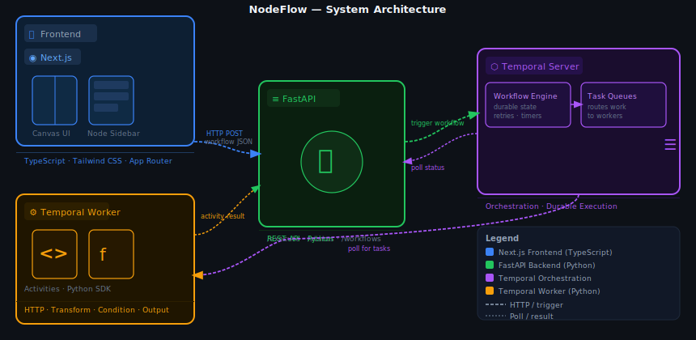

# 🔀 NodeFlow

> **No code workflow agent. Drag. Drop. Execute. NodeFlow handles the rest.**

NodeFlow is a visual, no-code workflow automation platform inspired by tools like n8n. It lets you design complex multi-step agent workflows by dragging nodes onto a canvas, connecting them, and hitting execute — without writing a single line of code. Under the hood, it orchestrates durable, fault-tolerant execution using Temporal.

---

## ✨ What It Does

- Drag-and-drop node-based workflow builder in the browser
- Connect nodes to define data flow and execution order
- Execute workflows that run as durable, retryable jobs via Temporal
- FastAPI backend handles workflow registration, execution, and state
- Nodes can represent API calls, data transforms, conditionals, and more

---

## 🏗️ System Architecture



**Data Flow Summary:**
1. User builds a workflow visually in the browser (Next.js)
2. On "Execute", the graph is serialized to JSON and sent to FastAPI
3. FastAPI registers and triggers a Temporal Workflow
4. Temporal durably orchestrates execution, managing retries and state
5. The Temporal Worker picks up tasks and runs the actual activity logic node by node
6. Results and status are polled back to the UI

---

## 🛠️ Tech Stack

| Layer | Technology | Purpose |
|---|---|---|
| **Frontend** | Next.js 14 (App Router) | UI framework, routing, SSR |
| **Language** | TypeScript | Type-safe frontend code |
| **Styling** | Tailwind CSS | Utility-first styling |
| **Canvas / Nodes** | Custom (components/) | Drag-drop node editor |
| **Backend** | FastAPI (Python) | REST API, workflow triggering |
| **Orchestration** | Temporal | Durable workflow execution |
| **Worker** | Python (Temporal SDK) | Activity/task execution |

---

## 📁 Project Structure

```
nodeFlow/
├── app/                    # Next.js App Router pages
├── components/             # React components (canvas, nodes, sidebar)
├── lib/                    # Shared utilities, types, API client
├── public/                 # Static assets
├── backend/                # FastAPI + Temporal worker (Python)
│   ├── main.py             # FastAPI app & routes
│   ├── workflows.py        # Temporal workflow definitions
│   ├── activities.py       # Temporal activity (node execution) logic
│   └── worker.py           # Temporal worker entry point
├── next.config.ts
├── tailwind.config.ts
└── package.json
```

---

## 🚀 How to Run Locally

### Prerequisites

- Node.js 18+
- Python 3.11+
- [Temporal CLI](https://docs.temporal.io/cli) (`brew install temporal` on macOS)

### 1. Start the Temporal Development Server

```bash
temporal server start-dev
```

This starts a local Temporal server + UI at `http://localhost:8233`.

### 2. Start the FastAPI Backend + Temporal Worker

```bash
cd backend
pip install -r requirements.txt
uvicorn main:app --reload --port 8000
```

In a separate terminal:
```bash
cd backend
python worker.py
```

### 3. Start the Next.js Frontend

```bash
npm install
npm run dev
```

Open `http://localhost:3000`

---

## ⚠️ Why There Is No Live Demo

NodeFlow is not currently deployed with a live link, and here's why.

The frontend (Next.js) and backend (FastAPI) are relatively straightforward to deploy on platforms like Vercel and Railway. However, **Temporal is the bottleneck**.

Temporal requires a long-running, always-on **Worker process** — a Python process that polls Temporal's task queue and executes the actual workflow activities. This kind of persistent background process is not compatible with serverless deployment models (like Vercel Functions or similar), which are stateless and spin up/down on demand.

Hosting a Temporal Worker properly requires either:
- A **dedicated cloud VM** (e.g., AWS EC2, GCP Compute Engine) — which costs money and requires manual setup
- A **managed Temporal Cloud** account — which has its own cost and configuration overhead
- **Docker + a container hosting service** (e.g., Railway, Render) that supports always-on workers

At this stage of the project, I haven't set up any of the above. The result is that while the frontend can be deployed and the FastAPI backend can be hosted, without the worker running, **no workflow will ever actually execute** — so a "live demo" would be functionally broken and misleading.

I'd rather be upfront about this than ship a half-working demo. The code is all here — if you clone it and run Temporal locally, everything works end-to-end.

---

## 🔮 What I'd Improve Next

- **Persistent storage** — workflows are currently in-memory. Adding a database (PostgreSQL or SQLite) to save and load workflow definitions would make this genuinely useful.
- **More node types** — right now the node library is limited. Adding HTTP request nodes, conditional branching, loops, and LLM-call nodes would make it much more powerful.
- **Real-time execution feedback** — stream node execution status back to the canvas in real-time using WebSockets or SSE so users can watch their workflow run live.
- **Proper deployment** — containerize the entire stack with Docker Compose (frontend, backend, worker, Temporal) and deploy it properly.
- **Authentication** — add user accounts so people can save their own workflows.

---

## 📄 License

MIT
