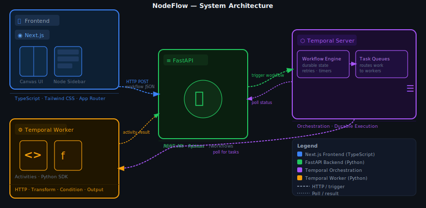

# 🔀 NodeFlow

> **No code workflow agent. Drag. Drop. Execute. NodeFlow handles the rest.**

NodeFlow is a visual, no-code workflow automation platform inspired by tools like n8n. It lets you design complex multi-step agent workflows by dragging nodes onto a canvas, connecting them, and hitting execute — without writing a single line of code. Under the hood, it orchestrates durable, fault-tolerant execution using Temporal.

---

## ✨ What It Does

- Drag-and-drop node-based workflow builder in the browser
- Connect nodes to define data flow and execution order
- Execute workflows that run as durable, retryable jobs via Temporal
- FastAPI backend handles workflow registration, execution, and state
- Nodes can represent API calls, data transforms, conditionals, and more

---

## 🏗️ System Architecture



**Data Flow Summary:**
1. User builds a workflow visually in the browser (Next.js)
2. On "Execute", the graph is serialized to JSON and sent to FastAPI
3. FastAPI registers and triggers a Temporal Workflow
4. Temporal durably orchestrates execution, managing retries and state
5. The Temporal Worker picks up tasks and runs the actual activity logic node by node
6. Results and status are polled back to the UI

---

## 🛠️ Tech Stack

| Layer | Technology | Purpose |
|---|---|---|
| **Frontend** | Next.js 14 (App Router) | UI framework, routing, SSR |
| **Language** | TypeScript | Type-safe frontend code |
| **Styling** | Tailwind CSS | Utility-first styling |
| **Canvas / Nodes** | Custom (components/) | Drag-drop node editor |
| **Backend** | FastAPI (Python) | REST API, workflow triggering |
| **Orchestration** | Temporal | Durable workflow execution |
| **Worker** | Python (Temporal SDK) | Activity/task execution |

---

## 📁 Project Structure

```
nodeFlow/
├── app/                    # Next.js App Router pages
├── components/             # React components (canvas, nodes, sidebar)
├── lib/                    # Shared utilities, types, API client
├── public/                 # Static assets
├── backend/                # FastAPI + Temporal worker (Python)
│   ├── main.py             # FastAPI app & routes
│   ├── workflows.py        # Temporal workflow definitions
│   ├── activities.py       # Temporal activity (node execution) logic
│   └── worker.py           # Temporal worker entry point
├── next.config.ts
├── tailwind.config.ts
└── package.json
```

---

## 🚀 How to Run Locally

### Prerequisites

- Node.js 18+
- Python 3.11+
- [Temporal CLI](https://docs.temporal.io/cli)
- (`docker run --rm -p 7233:7233 -p 8233:8233 temporalio/temporal server start-dev --ip 0.0.0.0` using Docker)

### 1. Start the Temporal Server

```bash
temporal server start-dev
```

### 2. Start the FastAPI Backend + Temporal Worker

```bash
cd backend
pip install -r requirements.txt
uvicorn main:app --reload --port 8000
```

In a separate terminal:
```bash
cd backend
python temporal_app/worker.py
```

### 3. Start the Next.js Frontend

```bash
npm install
npm run dev
```

Open `http://localhost:3000`

---

## 🌍 Production Deployment Architecture

NodeFlow is fully deployed on **Railway** using Docker containers. 

### Why Railway and not Vercel?
NodeFlow includes a **Temporal Worker** — a Python process that runs 24/7 in the background, constantly polling the Temporal queue to physically execute workflow tasks. 

Serverless platforms like Vercel (for Next.js) or standard AWS Lambda are designed to spin up on-demand and shut down instantly after an HTTP request finishes. They **cannot** run persistent background polling processes. 

To solve this, the entire stack was containerized into Docker images and deployed to Railway, which supports long-lived Docker containers native to the `docker-compose` topology:

| Service | Technology | Role |
|---|---|---|
| **Frontend** | Node.js (Alpine) | Serves the Next.js UI |
| **Backend** | Python 3.11 | FastAPI server, handles API requests and triggers workflows |
| **Worker** | Python 3.11 | Always-on background process executing Temporal activities |
| **Temporal** | Go (Docker) | The orchestration engine queueing and managing workflow state |

The services communicate over Railway's private internal network (`*.railway.internal`), ensuring the Temporal engine is never exposed to the public internet.

---

## 🔮 What I Could Have Done Better

While the current architecture works end-to-end, there are several areas I would improve for a true production-grade system:

### 1. Database Persistence
Currently, workflows are saved using a local SQLite database (`dev.db`). In a containerized deployment on Railway, the local filesystem is ephemeral — meaning saved workflows are wiped out whenever the container restarts or redeploys. 
- **The Fix:** Migrate Prisma to use a persistent managed PostgreSQL database instead of local SQLite.

### 2. Temporal State Management
The deployed Temporal instance runs in `--dev` mode, which stores all workflow execution history in memory. If the Temporal container restarts, the history of past executions is lost.
- **The Fix:** Deploy a true Temporal Cluster backed by a persistent PostgreSQL database and Elasticsearch, or migrate it to Temporal Cloud.

### 3. Real-time UI Updates
When a workflow is executing, the frontend frequently polls the `/api/workflows/status/{id}` endpoint to check if the nodes have succeeded or failed.
- **The Fix:** Replace HTTP polling with **WebSockets** or **Server-Sent Events (SSE)**. The Temporal worker could push state changes directly to the UI, making the canvas light up and animate in real-time as nodes execute.

### 4. Expanded Node Ecosystem
The current node palette is basic (API calls, data transforms, decision nodes). 
- **The Fix:** Build a plugin architecture to easily add new nodes, such as LLM integrations (OpenAI/Anthropic), Database queries (SQL execution), or Slack/Discord webhooks.

### 5. Frontend Bundle Optimization
The `next.config.ts` was switched to `output: "standalone"` to support the Docker build, but the frontend image size is still substantial.
- **The Fix:** Optimize the multi-stage Dockerfile further by utilizing `pnpm` for leaner dependency trees and aggressive caching.

---

## 📄 License

MIT
